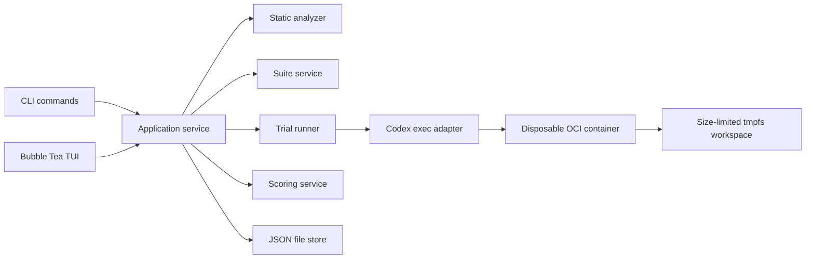
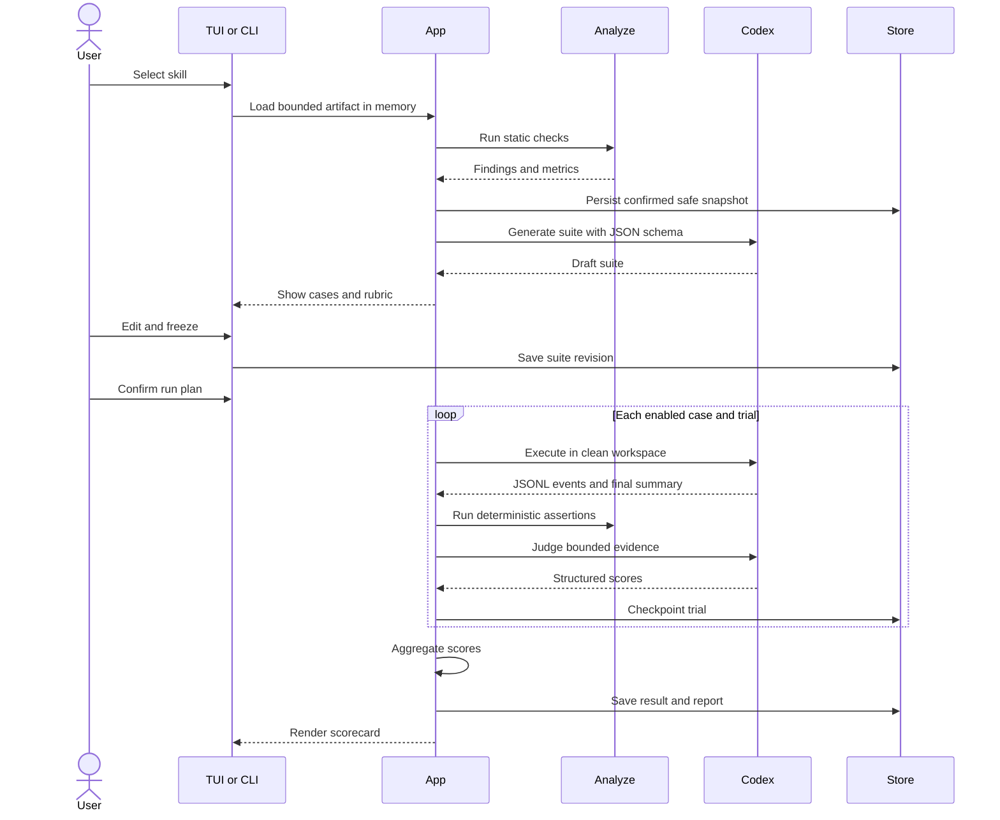

# mdbench technical design

Status: Approved
Date: 2026-07-15

## 1. Overview

mdbench is one Go binary with two interfaces:

- a terminal UI for guided use;
- subcommands for scripts and CI.

Both interfaces call the same application layer. The application reads a Markdown skill, runs static checks, creates or loads a frozen test suite, starts isolated Codex trials, judges the evidence in fresh sessions, saves the run, and compares saved runs.

The first release is local only. It has no server, database, account system, or plugin layer.
Its supported hosts are macOS and Linux with Docker or Podman available. Native Windows execution is deferred.



## 2. Decisions at a glance

| Area | Decision |
|---|---|
| Language | Go |
| CLI parsing | Standard library `flag.FlagSet` |
| TUI | Bubble Tea, Bubbles, Lip Gloss, and Huh |
| Markdown | Goldmark AST |
| Frontmatter | `yaml.v3` |
| Storage | Versioned JSON files and Markdown reports |
| Charts | Small in-house horizontal bar renderer |
| Execution harness | Codex non-interactive CLI |
| Process launch | `os/exec` with argument arrays, never a shell |
| Trial isolation | Disposable OCI container, size-limited tmpfs, read-only inputs, Codex permission profile |
| Container runtime | Docker or Podman; required for model calls and assertions |
| Concurrency | Fixed worker pool, default one |
| Comparison | Two complete runs with the same suite ID, revision, hash, and material config |
| Harness scope | Codex only; adapter interface kept for later providers |
| Defaults | Six cases, one trial, equal dimension weights, one worker, network off |
| Suite review | Mandatory before freeze; no quick or unsafe bypass |
| Generator model | Judge model, so users configure only executor and judge roles |
| Evidence | Bounded, redacted transcripts saved by default |
| Intake and export | Plain Markdown wrapper; JSON data and Markdown reports |

This is the smallest design that meets the approved requirements. SQLite, Cobra, a dependency injection container, a message bus, and a chart package do not add enough value for the MVP.

## 3. Scope and affected areas

The project is new. It affects only:

- the `mdbench` binary;
- the user's mdbench config and data directories;
- temporary trial workspaces;
- child Codex processes;
- fixture repositories selected for a suite.

mdbench does not modify the source skill or the user's working repository. It copies the skill and fixture into a trial directory before execution.

### Proposed package layout

```text
cmd/mdbench/          command parsing and process exit codes
internal/app/         use cases and orchestration
internal/model/       persisted structs and score math
internal/analyze/     Markdown and frontmatter checks
internal/suite/       generation, validation, freeze, and hashing
internal/harness/     harness interface and Codex adapter
internal/sandbox/     OCI lifecycle, mounts, limits, and process cleanup
internal/assert/      deterministic trial checks
internal/store/       local JSON store and atomic writes
internal/report/      Markdown report and terminal chart data
internal/tui/         Bubble Tea screens and shared components
```

Only the harness and OCI runtime boundary have interfaces in the MVP. The runtime has Docker and Podman command implementations. The file store and other services stay concrete.

## 4. Local files

mdbench resolves platform paths once at startup. Flags can override every path.

```text
<config>/mdbench/config.json
<data>/mdbench/
  fixtures/<fixture-sha>/
    manifest.json
    files/
  suites/<suite-id>/<revision>.json
  runs/<run-id>/
    manifest.json
    artifact/
      source/SKILL.md
      source/files/
      effective/SKILL.md
      manifest.json
    suite.json
    static.json
    result.json
    report.md
    trials/<case-id>/<trial-number>/
      events.jsonl
      stderr.log
      final.json
      diff.patch
      assertions.json
<cache>/mdbench/work/
```

One store goroutine owns all run writes. It writes evidence first, flushes it, atomically renames it, then publishes the manifest that references it. Startup reconciliation removes unreferenced temporary files and marks missing referenced evidence incomplete. A run manifest moves through `planned`, `running`, `judging`, `complete`, `partial`, `cancelled`, or `failed`.

Credentials never enter these files. The Codex CLI uses its existing authentication.

Configuration precedence is command flag, environment override, config file, then built-in default. The settings screen shows the source beside each effective value. The run stores the resolved values, not just user overrides. Environment overrides hold non-secret settings only; credentials remain owned by Codex.

Before live display or persistence, all model text, process output, diffs, and event fields pass through one redaction and size-limit boundary. Malformed JSONL is redacted before its bounded form is shown or saved. The saved record notes each redaction or truncation.

The exact source artifact is the one exception because reproducibility requires it. A secret-like finding blocks snapshot persistence and model calls; the user must remove the value before continuing. mdbench never offers an unsafe bypass for this check in the MVP.

## 5. Data model

All persisted structs include `schema_version`. IDs use a UTC timestamp plus 128 bits from `crypto/rand`. Hashes use SHA-256.

### Artifact snapshot

```go
type Artifact struct {
    ID               string
    Label            string
    Source           string
    BundleRoot       string
    ContentSHA       string
    BundleSHA        string
    EffectiveSHA     string
    TransformVersion string
    Markdown         string
    Frontmatter      map[string]any
}
```

`Source` is a path or `stdin`. A directory input resolves `SKILL.md` without case sensitivity. For a file, mdbench proposes a bundle containing the entry file plus paths found in Markdown links and known frontmatter fields. A referenced directory is expanded within count and size limits. The review screen lists every file for confirmation. The safe walker rejects escapes and symlinks, excludes `.git`, and scans the full bundle for secrets. Paste accepts either a complete skill or instructions-only Markdown; instructions receive a generated wrapper without changing the saved source. `EffectiveSHA` identifies the exact installed `SKILL.md`, including any generated wrapper.

### Frozen suite

```go
type Suite struct {
    ID               string
    Revision         int
    ContentSHA       string
    OriginArtifact   string
    Applicability    string
    Rubric           string
    RubricSHA        string
    Dimensions       []Dimension
    HardFailureRules []HardFailureRule
    Cases            []Case
}

type FixtureRef struct {
    ID          string
    Setup       string
    ContentSHA  string
    ImageDigest string
}

type Dimension struct {
    ID           string
    Name         string
    Weight       float64
    Applicable   bool
    Guidance     string
    ScoreAnchors map[string]string
}

type Case struct {
    ID               string
    Title            string
    Prompt           string
    Fixture          FixtureRef
    TimeoutSeconds   int
    Weight           float64
    Assertions       []AssertionSpec
    JudgeCriteria    []string
    EvidenceRequired []string
    Dimensions       []string
    Enabled          bool
}
```

Importing a fixture copies a bounded tree with the same safe walker used for artifacts, writes a file manifest, and hashes canonical relative paths, modes, sizes, and contents. Freezing validates all references, normalizes the JSON, writes the immutable revision, and hashes the final bytes. Editing a frozen suite creates the next revision.

### Run and trial

```go
type Run struct {
    ID                 string
    Status             RunStatus
    MDBenchVersion     string
    ArtifactSHA        string
    SuiteID            string
    SuiteRevision      int
    SuiteSHA           string
    RubricSHA          string
    Config             RunConfig
    HarnessVersion     string
    RuntimeVersion     string
    EffectiveConfigSHA string
    StartedAt          time.Time
    FinishedAt         *time.Time
    Trials             []TrialResult
    Aggregate          *AggregateScore
    Warnings           []string
}

type TrialResult struct {
    CaseID          string
    Trial           int
    Status          TrialStatus
    Duration        time.Duration
    Assertions      []AssertionResult
    Judge           *JudgeResult
    Usage           Usage
    EvidenceFiles   []string
}
```

The result file stores relative evidence paths. It does not duplicate transcript or patch content.

The manifest is a crash-recovery checkpoint while work is active. Once a run reaches a terminal state, its snapshot, suite, result, and report are immutable.

## 6. Main data flow

### New suite and run



### Reuse and comparison

The user selects a frozen suite before running another artifact. mdbench shows the suite origin and applicability text. The user confirms that the cases fit the new skill.

Comparison reads two saved runs. It never calls a model. A comparison is configuration-matched only when these fields match:

- suite ID, revision, and content hash;
- Codex CLI version;
- mdbench scoring, prompt, and schema versions;
- OCI runtime, image digest, platform, and fixture hashes;
- executor model;
- judge model;
- trial count;
- timeout, concurrency, retry, and failure policies;
- network policy;
- reasoning and other material Codex settings;
- the full effective-configuration hash.

Other comparisons are still viewable, but the UI labels every mismatch as a confounder. A full match receives `Fair: configuration matched`. If the provider exposes only a mutable model alias, the same view adds a model-drift caveat.

Comparison covers overall score, dimension and case scores, deterministic outcomes, duration, and available usage. It reads persisted values only.

## 7. Codex harness

The adapter uses the documented `codex exec` non-interactive interface. JSONL output gives mdbench command, file change, message, error, thread, and usage events. `--output-schema` constrains generator, executor summary, and judge results. `--ephemeral` prevents Codex rollout persistence.

Sources: [Codex non-interactive mode](https://learn.chatgpt.com/docs/non-interactive-mode.md) and [Codex permission profiles](https://learn.chatgpt.com/docs/permissions.md).

```go
type Harness interface {
    Validate(context.Context, HarnessConfig) error
    GenerateSuite(context.Context, GenerateRequest) (SuiteDraft, Evidence, error)
    Execute(context.Context, TrialRequest) (ExecutionEvidence, error)
    Judge(context.Context, JudgeRequest) (JudgeResult, Evidence, error)
}

type Runtime interface {
    Validate(context.Context) error
    Start(context.Context, ContainerSpec) (ContainerID, error)
    Exec(context.Context, ContainerID, ProcessSpec) (ProcessResult, error)
    Stop(context.Context, ContainerID, time.Duration) error
}
```

The adapter launches the OCI runtime with `exec.CommandContext`; the runtime launches Codex inside the container. Every flag is a separate argument, and long evidence packages use standard input. The image is pinned by digest and contains the Codex CLI plus the MVP fixture toolchains.

Each call gets a generated, read-only `CODEX_HOME` containing only mdbench's strict config and Codex authentication. The config sets `default_permissions` to the call's named profile, passes a minimal environment to commands, denies the credential directory and `/proc/*/environ`, and grants only these paths:

- generator and judge: minimal runtime files plus read-only control input;
- executor: minimal runtime files, a writable `/work`, and a read-only candidate skill;
- network: explicitly false unless the reviewed run plan enables it.

The MVP supports Codex saved authentication through a read-only `auth.json` mount and `CODEX_API_KEY` through the Codex process environment. Neither is copied into evidence. Preflight first uses `codex sandbox --permission-profile` for a local check. On the first use of a new image, Codex version, platform, or permission-config hash, it also runs one control-profile and one executor-profile `codex exec` canary. The JSONL must show allowed workspace access and denied credential, host-path, and network attempts. These paid probes appear in the execution plan and their pass result is cached. Any missing attempt, unexpected access, version mismatch, or invalid config blocks model calls.

### Generator command shape

```text
codex
  --ask-for-approval never
  --model <judge-model>
  exec
  --ephemeral
  --json
  --strict-config
  --ignore-rules
  --skip-git-repo-check
  --output-schema <suite-schema>
  -o /out/draft-suite.json
  <generation-prompt>
```

The artifact is a quoted input file in a read-only control directory. It is not installed as a skill for generation.

### Executor command shape

```text
codex
  --ask-for-approval never
  --model <executor-model>
  exec
  --ephemeral
  --json
  --strict-config
  --ignore-rules
  --skip-git-repo-check
  --output-schema <executor-summary-schema>
  -o /out/final.json
  <case-prompt>
```

The process runs with the writable trial mount as its current directory. The effective artifact is mounted read-only at `.codex/skills/<skill-name>/`. Any attempted mutation fails and becomes trial evidence. If the Markdown has no valid skill name, mdbench wraps it with generated frontmatter under the fixed name `mdbench-candidate`. The body remains unchanged; the exact effective file, transform version, and hash are saved.

mdbench takes a safe filesystem snapshot before and after execution. It records new, changed, deleted, binary, mode, and symlink entries without following symlinks. This captures untracked output and avoids fixture Git hooks, filters, and local config. Read-only skill and benchmark mounts are outside the scored tree.

### Judge command shape

The judge command matches the generator command but uses the judge schema. Its control directory contains:

- the frozen rubric;
- deterministic assertion results;
- the bounded final answer;
- the bounded workspace diff;
- selected JSONL evidence;
- test output and exit status.

The candidate, diff, transcript, final answer, and test output are all marked as untrusted evidence. The judge has read-only access to a bounded evidence directory, no project tools, and no conversation with the executor. Schema validation limits shape, not bias; prompt injection remains a recorded risk.

### Environment and limits

The container sees only read-only control, fixture, artifact, and credential mounts. `/work` and private `/out` are size-limited tmpfs mounts. `/out` is outside the command permission profile, so model-run commands cannot inspect final structured output. The container has no host home, source repository, SSH agent, Docker socket, or unrelated filesystem mount. CPU, memory, and process limits are set.

Assertion containers and other non-Codex workloads drop all Linux capabilities and disable privilege escalation. The trusted Codex launcher container uses a separate Linux compatibility policy because Bubblewrap must create the inner command sandbox. That policy adds only the capabilities verified as necessary and relaxes the outer seccomp and AppArmor profiles. It never mounts the Docker socket or unrelated host paths. Model-run commands execute inside the named Codex permission profile, and preflight blocks every model call unless the boundary canary confirms bounded writes plus denied credential, host, and command-network access.

Codex itself can read its credential and reach the provider. Model-run commands cannot read the credential paths or inherit credential variables. This boundary is tested, but it is still not a claim that the container can safely run malware.

Each process has:

- a context deadline;
- a maximum stdout, stderr, JSONL, final answer, and diff size;
- an owned runtime process plus container ID;
- command network disabled explicitly by the Codex permission profile;
- a clean current directory;
- size-limited `/work` and `/out` tmpfs mounts.

Cancellation stops scheduling, asks the runtime to stop the container, waits for a short grace period, kills it if needed, and waits for the runtime process. This terminates the full child tree on macOS and Linux through Docker or Podman rather than relying on `CommandContext` alone.

When the user enables network access for trial commands, mdbench switches to the reviewed network-enabled permission profile and shows a second confirmation in the execution plan. The run records `off` or `on`; there is no hidden fallback from off to on. The outer container still needs provider access for Codex itself.

The OCI boundary protects host files; the Codex permission profile adds command-level restrictions inside it. Neither is presented as a malware-analysis environment. mdbench records the requested model name because a provider alias may change without exposing a fixed upstream revision.

## 8. Static analysis

Goldmark builds the Markdown AST. `yaml.v3` parses frontmatter when present. For compatibility with existing skills, mdbench retries a failed parse after treating a single-line plain `description` as literal text; the original source and hashes stay unchanged. Checks return a severity, stable check ID, message, and source span.

Markdown checks target the entry file. Path, size, encoding, and secret checks cover every proposed bundle file before the user can confirm it.

The first check set covers:

- empty, unreadable, oversized, or invalid UTF-8 input;
- malformed frontmatter and invalid known field types;
- unbalanced fenced code blocks;
- duplicate headings;
- broken internal heading links;
- relative references that escape the artifact root or do not exist;
- placeholder markers;
- likely secrets, with matched values redacted;
- size and structure metrics.

Each finding includes a short correction hint. Secret findings persist the pattern class and location, never the matched value.

Static findings do not receive LLM scores. A frozen suite can map a stable check ID to a hard failure or score cap.

The MVP selects one Markdown entry file and snapshots its bounded artifact directory. Relative scripts and assets therefore travel with the skill. References outside that root are errors.

## 9. Test suite generation and review

The generator receives:

- the artifact as untrusted text;
- the eight approved score dimensions;
- allowed fixture IDs;
- the assertion schema;
- limits for case count, command duration, and evidence size;
- instructions to avoid artifact-specific names in expected results.

The MVP ships four small, immutable fixtures: empty workspace, basic Go module, basic Node package, and basic Python package. They are embedded with file manifests and copied into the content-addressed fixture store on first use. The generate screen lets the user choose which fixtures the model may reference. Importing arbitrary local fixtures is deferred.

The default draft has six cases and equal weights across the eight approved dimensions. The user may choose another case count, change weights, or mark a dimension not applicable before freezing.

The generator returns JSON that matches the suite schema. mdbench validates it again in Go. A draft cannot freeze until:

- every case has a unique stable ID;
- all dimensions and weights are valid;
- each score dimension has clear 0, 5, and 10 anchors;
- fixture references exist;
- command assertions use argument arrays and relative working directories;
- paths remain inside the fixture;
- at least one deterministic assertion or required evidence item exists per case;
- hard failure rules target known checks or assertions.

The TUI exposes the full draft. Nothing runs until the user freezes it.

## 10. Trial workspace and assertions

### Workspace setup

For each trial, mdbench:

1. starts a limited executor container with size-limited `/work` and `/out` tmpfs mounts;
2. copies the frozen fixture into `/work` with the image's trusted helper;
3. records the baseline filesystem manifest;
4. mounts the effective skill read-only and runs Codex;
5. captures events and final output, then stops model activity;
6. exports a bounded post-execution manifest and archive through the trusted helper;
7. computes the scored diff before tests can alter files;
8. destroys the credential-bearing executor container;
9. imports the archive into a new assertion container with `--network none`, a read-only root, size-limited `/work` tmpfs, no auth, no host mounts, and the same CPU, memory, and process limits;
10. runs approved command assertions, captures bounded evidence, and destroys the assertion container.

### Assertion engine

Assertions are tagged structs, not executable scripts:

```text
command        argv, relative cwd, expected exit, timeout
file_exists    relative path and expected boolean
content_match  relative path, literal or regular expression
structured     relative JSON/YAML file, path expression, expected value
diff_scope     allowed and forbidden path patterns
diff_size      maximum files and lines changed
dependency     allowed, forbidden, or justified manifest change
forbidden_action command-event pattern or forbidden path mutation
status         executor completion and timeout state
```

Command checks run through `docker exec` or `podman exec` in the assertion container, never through `sh -c`. Suite review shows the exact argument array. Commands are limited to executables in the pinned image and run with a scrubbed environment. Arbitrary host hooks are not supported.

Path, content, and structured assertions read the exported archive through a no-follow resolver. Each path must exist in the captured manifest and remain below its root. Ordinary `Join` plus `ReadFile` is not allowed for untrusted paths.

Every assertion result records expected value, observed value, status, duration, and bounded output.

Forbidden-action checks match reviewed patterns against Codex command events and the final diff. They are evidence signals, not proof that the host is safe; the container and Codex permission profile remain the enforcement boundaries.

## 11. Scoring

### Trial scoring

The judge returns one score per applicable dimension:

```go
type DimensionScore struct {
    DimensionID string
    Score       float64
    Confidence  float64
    Evidence    []EvidenceRef
    Reason       string
}
```

Scores must be between 0.0 and 10.0 with one decimal place. Evidence references must point to captured items. mdbench rejects invented references.

Hard failure rules run after schema validation. They can replace or cap a judge score but cannot raise it.

### Aggregation

Hard-failure caps apply to each valid trial score before aggregation. For dimension `d`, case `c`, and valid trial scores `s`:

```text
case_mean(c,d) = sum(s) / count(s)
dimension(d)   = sum(case_weight(c) * case_mean(c,d)) / sum(case_weight(c))
overall        = sum(dimension_weight(d) * dimension(d)) / sum(dimension_weight(d))
```

The denominators include only enabled cases where the dimension applies and only dimensions marked applicable. A complete run requires every planned trial and judgment. A partial run uses the same formula over valid completed scores, labels the value provisional, and reports coverage; missing work is never treated as zero. mdbench stores raw values and the formula version, then rounds only for display.

For repeated trials, the report shows mean, minimum, maximum, and spread. A partial run shows a provisional score plus coverage. It has no fair-comparison badge.

### Evidence confidence

Confidence is not reliability. The UI shows two values:

- coverage: completed judged trials divided by planned trials;
- judge confidence: mean confidence from valid judge responses.

The label is:

- high when coverage is 100 percent, all required assertions ran, and mean confidence is at least 0.8;
- medium when coverage is 100 percent and mean confidence is at least 0.6;
- low otherwise.

## 12. Terminal UI

The TUI follows the visual rules found during terminal.shop research but uses mdbench's own name and palette.

### Frame

- Large: centered canvas 80 columns wide and up to 30 rows tall.
- Medium: centered canvas 50 columns wide and up to 30 rows tall.
- Small: full terminal with one content pane.
- Minimum: 40 columns by 16 rows. Smaller terminals show a resize screen.

These sizes are the default policy for the primary setup flow, not a global limit. The layout boundary may accept a screen-specific size policy later, allowing a bounded larger or smaller canvas without changing other screens. No screen uses an override until the user explicitly requests one.

The header is one bordered row, three terminal cells tall. It contains `mdbench`, the current flow, and a compact run or model status. The footer shows only commands that work on the current screen.

### Palette

The app inherits the terminal background. Semantic colors adapt to light and dark backgrounds:

| Token | Dark terminal | Light terminal | ANSI-256 fallback |
|---|---|---|---:|
| Text | `#F2F4F5` | `#1B1F23` | 255 / 234 |
| Muted | `#889096` | `#667078` | 102 |
| Border | `#3A3F42` | `#D7DBDF` | 59 / 188 |
| Accent | `#FF6A00` | `#D94F00` | 202 |
| Success | `#2EA043` | `#1A7F37` | 29 |
| Warning | `#D29922` | `#9A6700` | 172 |
| Error | `#F85149` | `#CF222E` | 203 |

Charts include numbers and symbols, so color is never the only signal. Orange is mdbench's own accent. The terminal.shop influence is structural: a centered canvas, boxed header, contextual footer, and responsive master-detail layout.

### Screen pattern

Each step uses one of three layouts:

- selection list with a detail pane;
- form with a short explanation;
- progress or result view.

Large screens use list and detail panes. Medium and small screens show one pane at a time. `Enter` opens detail and `Esc` returns.

The file step opens directly in an `ls -la`-style browser at the current user's home directory. It includes hidden entries, permissions, and sizes. The search field stays active: typing filters the loaded directory by case-insensitive filename substring, `Up` and `Down` move the result cursor, and `Enter` immediately opens the highlighted folder or selects the highlighted Markdown file. `Right` also opens a folder, `Left` returns to the parent folder, and entering any folder clears the query while keeping the search field active. `Esc` clears a query first and leaves the browser when the query is empty. There is no free-form path field. The browser is an isolated TUI component built on `os.ReadDir` and the existing Bubbles text input; it emits only selected and canceled events.

Selection lists wrap at both ends. Footer help renders every key and action as a separate group. The paste editor fills the content pane: `Enter` inserts a line, `Command+Enter` reviews when supported, and `Ctrl+S` provides a terminal-safe fallback. Successful saves and suite freezes move directly to the next decision. The flow keeps reviews only for the input snapshot, generated tests, cross-input suite relevance, and the final execution plan.

### Shared controls

| Key | Action |
|---|---|
| `Up` and `Down` | Move selection and wrap at list ends, or scroll when no list is focused |
| `PageUp` and `PageDown` | Scroll the focused detail pane |
| `Enter` | Select, open, or continue |
| `Esc` | Back, close overlay, or open cancellation while work is active |
| `Tab` and `Shift+Tab` | Move between form fields |
| `?` | Open help overlay |
| `q` | Quit from a navigation screen when no work is active |

Scrollable panes show a position marker such as `3/12`, and the footer keeps its scroll keys visible. Text editors consume normal character keys. Special keys appear in the footer and in the final flow diagram.

## 13. CLI

`cmd/mdbench` uses one `flag.FlagSet` per subcommand.

```text
mdbench
mdbench eval <artifact> --suite <id@revision> [run flags]
mdbench eval --stdin --suite <id@revision> [run flags]
mdbench compare <run-a> <run-b> [--format text|json]
mdbench runs [--json]
mdbench show <run-id> [--json]
mdbench config [--json]
```

Run flags cover harness, executor model, judge model, trials, timeout, network, concurrency, failure policy, output format, and output path. `--no-prompt` is accepted for clarity and is always implied by a subcommand. A CLI evaluation requires an existing frozen suite; suite generation and review stay in the TUI for MVP. Missing required values are usage errors.

Exit codes:

| Code | Meaning |
|---:|---|
| 0 | Command completed, including a complete low-scoring evaluation |
| 1 | Internal, storage, or harness failure |
| 2 | Invalid command or configuration |
| 3 | Run is partial or cancelled |

Human progress goes to stderr. JSON and report output go to stdout or the requested file.

## 14. Error handling and recovery

| Failure | Behavior |
|---|---|
| Invalid artifact | Stop before model calls and show source findings |
| Invalid generated JSON | Retry once with validation errors, then keep a failed draft |
| Missing runtime, image, Codex, auth, model, or fixture | Fail preflight before run creation |
| Trial timeout | Stop then kill the container, save evidence, mark trial incomplete |
| JSONL parse error | Redact and save the bounded line, then mark evidence incomplete |
| Assertion command timeout | Stop the container, fail that assertion, skip later commands |
| Judge schema error | Retry once, then mark judging incomplete |
| Provider rate limit | Retry with capped exponential backoff, then mark the stage incomplete |
| Disk write failure | Keep the previous atomic file and stop new work |
| User cancellation | Stop scheduling, kill active trials, checkpoint completed work |
| App crash or lost terminal | Existing checkpoints remain readable as partial runs |

Errors have stable codes and a user message. Wrapped Go errors keep the operation and cause for logs. The TUI restores the alternate screen and cursor through deferred cleanup.

## 15. Testing strategy

### Unit tests

- artifact hashing and frontmatter parsing;
- every static check;
- suite validation and immutable revision hashing;
- assertion parsing and execution;
- JSONL event parsing and size limits;
- score caps, aggregation, coverage, and confidence labels;
- comparison fairness and confounder detection;
- redaction and atomic store behavior;
- safe filesystem snapshots and artifact/fixture limits;
- container argument, mount, capability, and network policies.

### TUI tests

Golden views cover:

- 120 by 40;
- 80 by 30;
- 80 by 24;
- 50 by 24;
- 49 by 20;
- 39 by 15 resize mode;
- light, dark, and no-color profiles.

Model tests send key messages directly to Bubble Tea models and check the next screen, selected item, footer commands, and cancellation state.

### Integration tests

A fake runtime and fake `codex` executable emit recorded lifecycle events, JSONL, and final JSON. Tests cover mount construction, success, malformed events, timeout, full-container cancellation, partial output, assertion isolation, and judge failure without model calls.

Live Codex smoke tests require an explicit environment flag. The default test command never spends tokens or uses network access.

## 16. Risks and tradeoffs

| Risk | Mitigation or accepted limit |
|---|---|
| Judge bias | Freeze detailed anchors, require evidence, keep objective results separate |
| Prompt injection in any evidence | Mark all evidence untrusted, remove judge tools, use schemas, validate references, retain as residual risk |
| Container escape or credential probing | Pin the image, mount only inputs, scrub command env, disable trial network, and require a boundary canary. Keep strict capability dropping for assertions; limit the documented Bubblewrap exception to the trusted Codex launcher. Do not claim malware isolation. |
| Docker or Podman is unavailable | Block model calls in preflight; static analysis and saved-run viewing still work |
| Model drift | Save requested model, Codex version, prompt/config hashes, timestamps, suite hash, image digest, and fixture hash |
| Suite overfits its origin skill | Review applicability, ban origin names by default, reuse exact frozen cases |
| High cost or long runs | Show call count, default to six cases and one trial, use concurrency one |
| Large transcripts | Redact and cap files; mark truncated evidence |
| Compact terminal hides actions | Reserve footer space, use viewports, show resize screen below minimum |
| JSON files become slow at scale | Accept for MVP; add an index or database only after measured need |
| Pinned evaluation image is large | Accept one documented image for MVP; custom image building is deferred |

## 17. Complete TUI interaction flow

```mermaid
flowchart TD
    START["Start: mdbench"] --> HOME["Home\nNew evaluation | Compare runs | Saved runs | Settings"]
    HOME -->|"Up/Down: highlight"| HOME
    HOME -->|"n or Enter on New"| SOURCE["Choose artifact source\nFile | Paste"]
    HOME -->|"c or Enter on Compare"| BASELINE["Select complete baseline run"]
    HOME -->|"r or Enter on Saved runs"| RUNS["Saved run list"]
    HOME -->|"s or Enter on Settings"| SETTINGS["Settings form"]
    HOME -->|"q"| EXIT["Restore terminal and exit"]

    ANY["Any non-modal screen"] -.->|"?"| HELP["Help overlay"]
    ANY -.->|"PgUp/PgDn: scroll focused pane"| ANY
    ANY -.->|"q: quit from idle navigation screen"| EXIT
    HELP -->|"Esc or ?"| RETURN["Return to previous screen"]
    RESIZE["Terminal resize"] -.->|"Below 40x16"| TOO_SMALL["Resize terminal screen"]
    TOO_SMALL -->|"Resize to supported size"| RETURN

    SOURCE -->|"Up/Down"| SOURCE
    SOURCE -->|"Enter on File"| FILES["File picker"]
    SOURCE -->|"Enter on Paste"| PASTE["Paste editor"]
    SOURCE -->|"Esc"| HOME

    FILES -->|"Type path"| FILES
    FILES -->|"Tab: complete"| FILES
    FILES -->|"Up/Down: choose"| FILES
    FILES -->|"Enter on directory"| FILES
    FILES -->|"Enter on valid Markdown"| INSPECT["Inspect artifact\nHash, static findings, proposed bundle"]
    FILES -->|"Invalid, unreadable, or too large"| INPUT_ERROR["Blocking input error\nReason and correction"]
    INPUT_ERROR -->|"Enter"| FILES
    FILES -->|"Esc"| SOURCE

    PASTE -->|"Type or paste"| PASTE
    PASTE -->|"Command+Enter or Ctrl+S: review valid text"| INSPECT
    PASTE -->|"Command+Enter or Ctrl+S: invalid input"| PASTE_ERROR["Inline input error"]
    PASTE_ERROR -->|"Enter"| PASTE
    PASTE -->|"Esc: discard after confirm"| SOURCE

    INSPECT -->|"Up/Down: findings"| INSPECT
    INSPECT -->|"b: review bundled file list"| BUNDLE["Bundle review\nOnly entry file and resolved references"]
    BUNDLE -->|"Enter: confirm include set"| INSPECT
    BUNDLE -->|"Esc"| INSPECT
    INSPECT -->|"e: edit label"| LABEL["Version label field"]
    LABEL -->|"Enter: save"| INSPECT
    LABEL -->|"Esc: cancel"| INSPECT
    INSPECT -->|"Enter: confirm safe snapshot and continue"| SUITE_CHOICE["Test suite\nGenerate new | Reuse frozen"]
    INSPECT -->|"Esc"| SOURCE

    SUITE_CHOICE -->|"Up/Down"| SUITE_CHOICE
    SUITE_CHOICE -->|"Enter on Generate"| GEN_CONFIG["Generate and run config\nHarness: Codex, executor model, judge model, cases, trials, timeout, network, concurrency, failure policy"]
    SUITE_CHOICE -->|"Enter on Reuse"| SUITE_LIST["Frozen suite list"]
    SUITE_CHOICE -->|"Esc"| INSPECT

    GEN_CONFIG -->|"Tab/Shift+Tab or Up/Down: fields"| GEN_CONFIG
    GEN_CONFIG -->|"f: choose allowed fixtures"| FIXTURES["Fixture catalog\nempty, Go, Node, Python"]
    FIXTURES -->|"Up/Down and Space: allow or disallow"| FIXTURES
    FIXTURES -->|"Enter: save selection"| GEN_CONFIG
    FIXTURES -->|"Esc: discard selection"| GEN_CONFIG
    GEN_CONFIG -->|"Enter: generate"| GENERATING["Generating suite\nSpinner and elapsed time"]
    GEN_CONFIG -->|"Esc"| SUITE_CHOICE
    GENERATING -->|"c or Esc: cancel"| CANCEL_GEN["Cancel generation?"]
    CANCEL_GEN -->|"y"| GEN_CONFIG
    CANCEL_GEN -->|"n or Esc"| GENERATING
    GENERATING -->|"Success"| REVIEW["Suite review\nCases, assertions, rubric, anchors, rules, weights"]
    GENERATING -->|"Failure"| GEN_ERROR["Generation error"]
    GEN_ERROR -->|"r: retry"| GENERATING
    GEN_ERROR -->|"Esc"| GEN_CONFIG

    SUITE_LIST -->|"Up/Down"| SUITE_LIST
    SUITE_LIST -->|"Enter"| COMPAT["Suite compatibility\nOrigin and applicability"]
    SUITE_LIST -->|"e: edit as new draft revision"| EDIT_CONFIG["Edit-revision run config"]
    SUITE_LIST -->|"Esc"| SUITE_CHOICE
    COMPAT -->|"Enter: confirm relevance"| REUSE_CONFIG["Reuse run config\nHarness: Codex, executor model, judge model, trials, timeout, network, concurrency, failure policy"]
    COMPAT -->|"Esc"| SUITE_LIST
    EDIT_CONFIG -->|"Tab/Shift+Tab or Up/Down: fields"| EDIT_CONFIG
    EDIT_CONFIG -->|"Enter"| REVIEW
    EDIT_CONFIG -->|"Esc"| SUITE_LIST
    REUSE_CONFIG -->|"Tab/Shift+Tab or Up/Down: fields"| REUSE_CONFIG
    REUSE_CONFIG -->|"Enter"| PLAN["Execution plan\nModels, calls, limits, isolation"]
    REUSE_CONFIG -->|"Esc"| COMPAT

    REVIEW -->|"Up/Down: select case"| REVIEW
    REVIEW -->|"Space: enable or disable"| REVIEW
    REVIEW -->|"Ctrl+Up/Down: reorder"| REVIEW
    REVIEW -->|"e: edit selected case"| CASE_EDIT["Case editor"]
    REVIEW -->|"r: edit rubric"| RUBRIC["Rubric and weights editor"]
    REVIEW -->|"f: freeze"| FREEZE["Freeze suite revision?"]
    REVIEW -->|"Esc: generated draft"| GEN_CONFIG
    REVIEW -->|"Esc: edited revision draft"| EDIT_CONFIG
    CASE_EDIT -->|"Tab/Shift+Tab: fields"| CASE_EDIT
    CASE_EDIT -->|"Command+Enter or Ctrl+S: save draft"| REVIEW
    CASE_EDIT -->|"Esc: discard edits"| REVIEW
    RUBRIC -->|"Tab/Shift+Tab: dimensions"| RUBRIC
    RUBRIC -->|"Command+Enter or Ctrl+S: save draft"| REVIEW
    RUBRIC -->|"Esc: discard edits"| REVIEW
    FREEZE -->|"y: write immutable revision"| PLAN
    FREEZE -->|"n or Esc"| REVIEW

    PLAN -->|"Enter: network off"| PREFLIGHT["Preflight\nRuntime, image, Codex, auth, models, fixtures, disk"]
    PLAN -->|"Enter: network on"| NETWORK_CONFIRM["Confirm trial network risk"]
    PLAN -->|"Esc"| FROZEN_CONFIG["Run config for frozen suite\nHarness: Codex, executor and judge models; suite content locked"]
    FROZEN_CONFIG -->|"Tab/Shift+Tab or Up/Down: fields"| FROZEN_CONFIG
    FROZEN_CONFIG -->|"Enter"| PLAN
    FROZEN_CONFIG -->|"Esc"| SUITE_CHOICE
    NETWORK_CONFIRM -->|"y"| PREFLIGHT
    NETWORK_CONFIRM -->|"n or Esc"| PLAN
    PREFLIGHT -->|"Pass"| EXEC["Run progress\nCases and trials"]
    PREFLIGHT -->|"Fail"| PREFLIGHT_ERROR["Blocking preflight error"]
    PREFLIGHT_ERROR -->|"Enter: edit configuration"| FROZEN_CONFIG
    PREFLIGHT_ERROR -->|"Esc"| PLAN

    EXEC -->|"Up/Down: select trial"| EXEC
    EXEC -->|"Enter: live detail"| LIVE["Trial detail\nStage, elapsed, bounded events"]
    LIVE -->|"Esc"| EXEC
    EXEC -->|"c or Esc: cancel"| CANCEL_RUN["Cancel active run?"]
    CANCEL_RUN -->|"y"| PARTIAL["Checkpoint partial run"]
    CANCEL_RUN -->|"n or Esc"| EXEC
    EXEC -->|"All trials and judging finish"| RESULT["Run result\nPersistent COMPLETE or PARTIAL status, coverage, score bars"]
    EXEC -->|"Unrecoverable failure"| PARTIAL
    PARTIAL -->|"Open with PARTIAL badge; fair comparison disabled"| RESULT

    RESULT -->|"Up/Down: select dimension or case"| RESULT
    RESULT -->|"Enter on case"| CASE_RESULT["Case result\nAssertions, judge, usage"]
    RESULT -->|"d: deterministic checks"| STATIC_RESULT["Static findings"]
    RESULT -->|"e: evidence files"| EVIDENCE["Evidence index"]
    RESULT -->|"h: home"| HOME
    RESULT -->|"q"| EXIT
    CASE_RESULT -->|"Up/Down: select trial"| CASE_RESULT
    CASE_RESULT -->|"Enter: trial evidence"| TRIAL_RESULT["Trial evidence\nDiff, output, references"]
    CASE_RESULT -->|"Esc"| RESULT
    TRIAL_RESULT -->|"Left/Right: evidence section"| TRIAL_RESULT
    TRIAL_RESULT -->|"Esc"| CASE_RESULT
    STATIC_RESULT -->|"Up/Down"| STATIC_RESULT
    STATIC_RESULT -->|"Esc"| RESULT
    EVIDENCE -->|"Up/Down"| EVIDENCE
    EVIDENCE -->|"Enter: preview bounded file"| EVIDENCE_PREVIEW["Evidence preview"]
    EVIDENCE -->|"Esc"| RESULT
    EVIDENCE_PREVIEW -->|"Esc"| EVIDENCE

    BASELINE -->|"Up/Down"| BASELINE
    BASELINE -->|"Enter"| CANDIDATE["Select complete candidate run"]
    BASELINE -->|"Esc"| HOME
    CANDIDATE -->|"Up/Down"| CANDIDATE
    CANDIDATE -->|"Enter complete run"| FAIRNESS["Comparability check"]
    CANDIDATE -->|"Esc"| BASELINE
    FAIRNESS -->|"Enter: fair or accept confounders"| COMPARE["Comparison\nBaseline, candidate, delta bars"]
    FAIRNESS -->|"Esc"| CANDIDATE
    COMPARE -->|"Up/Down: dimension or case"| COMPARE
    COMPARE -->|"Enter"| COMPARE_DETAIL["Delta detail\nChanged evidence and outcomes"]
    COMPARE -->|"h"| HOME
    COMPARE -->|"Esc"| FAIRNESS
    COMPARE_DETAIL -->|"Esc"| COMPARE

    RUNS -->|"Up/Down"| RUNS
    RUNS -->|"Enter: open; Esc returns here"| RESULT
    RUNS -->|"c: use complete run as baseline"| CANDIDATE
    RUNS -->|"Esc"| HOME
    RESULT -->|"Esc: newly completed run"| HOME
    RESULT -->|"Esc: reopened saved run"| RUNS

    SETTINGS -->|"Tab/Shift+Tab: harness, models, runtime, limits, paths; each shows value source"| SETTINGS
    SETTINGS -->|"v: validate Codex"| VALIDATE["Validate binary, auth, and model"]
    VALIDATE -->|"Success or error"| SETTINGS
    SETTINGS -->|"Ctrl+S: save non-secret settings"| HOME
    SETTINGS -->|"Esc: discard edits"| HOME
```


